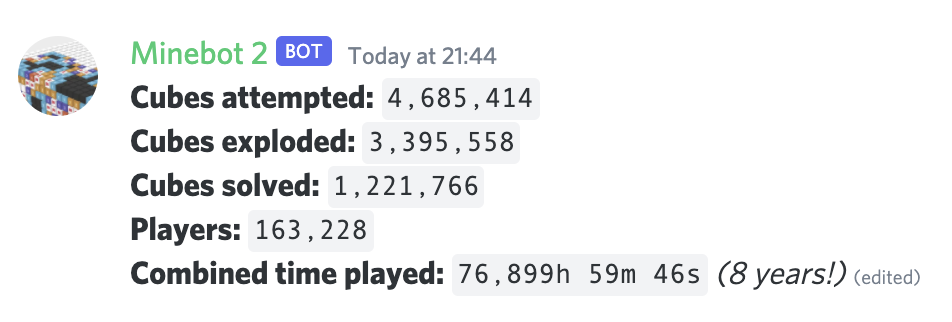

<h1 align=center>💣🤖</h1>
<h5 align=center>The Mastermine Discord #stats bot</h5>

## What?

Minebot generates the #stats section of the [Mastermine](https://mastermine.app/)
Discord server and keeps it up to date every second.

## How do I use it?

This repo is unlikely to be useful to anybody else, as it contacts a (for now!)
private API for stats information. However, it might be interesting for any curious
developers that would like to take a look at the code.

Pull requests are welcome, though they might not be reviewed/accepted in a timely
manner as development on Mastermine Multiplayer is well underway at the moment!
